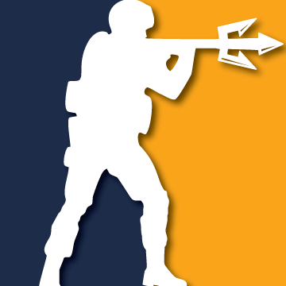
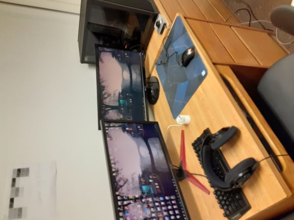

## Hello
```
#include <iostream>
int main() {
    std::cout << "My Name is James Daza";
    return 0;
}
``` 
## Who am I?
I am a/an: <br>
- **UCSD 3rd year Computer Science Student**
- **Avid [gamer](#favorite-games) **
- **[Coding](#languages) hobbyist**

Welcome to my humble page I am always aspiring to learn more about programming and further my knowledge in my craft. <br>
Link to short [README](README.md) with 
A good quote from Bill Gates I always like to think about is: <br>
> I choose a lazy person to do a hard job. Because a lazy person will find an easy way to do it.

# Languages
The language I am most proficient in is C++<br>
I also know:<br>
- *Python*
- *Java*
- *C*

I have also dabbled a little bit with HTML and CSS.
[Here](https://jrdaza.github.io/) is a link to another Github Pages I made in my free time very quickly:


As mentioned above I am an avid gamer and I love playing video [games](###favorite-games) especially competitive games. <br>
My favorite video game has to be CS:GO and an interesting fact is that I play amatuer leagues and also for a club in UCSD.
Here is some of the results from recent matches: https://cslesports.gg/team-detail/13510 <br>



Here is my current setup:<br>
 

# Favorite Games
My top 3 games currently are:
1. CS:GO
2. Escape from Tarkov
3. World of Warcraft

Some projects I want to create:
- [x] Personal Website
- [ ] Simple Video Game
- [ ] Full Web application
